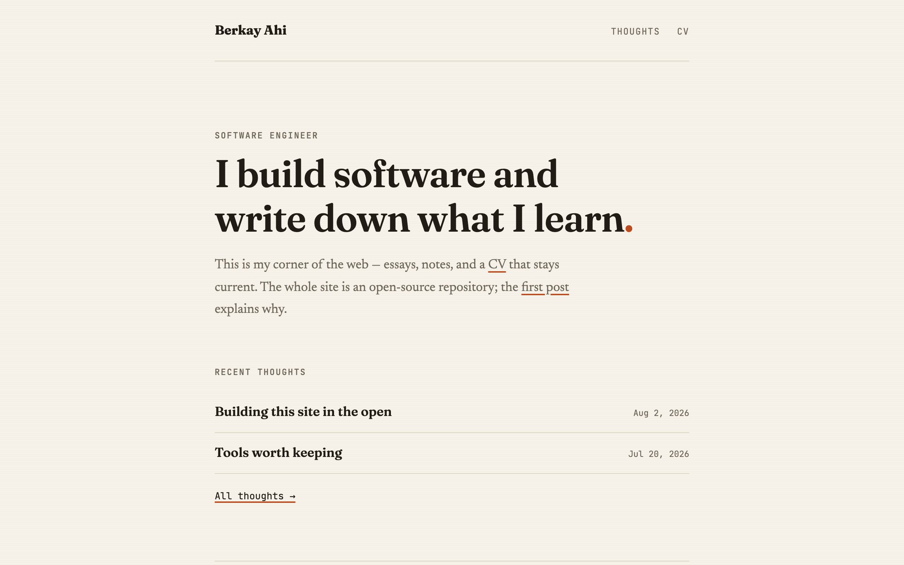
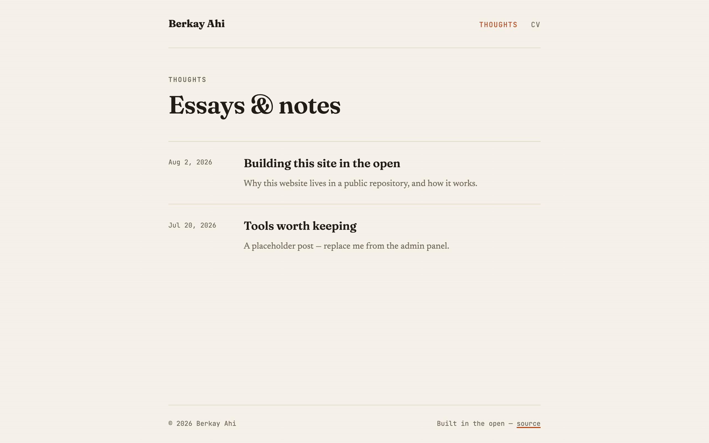
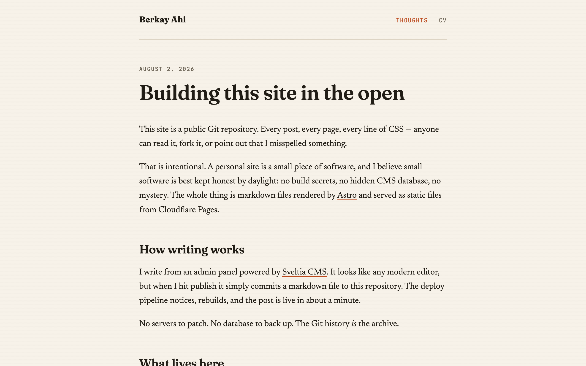
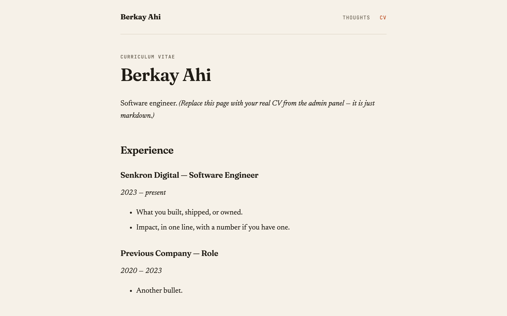
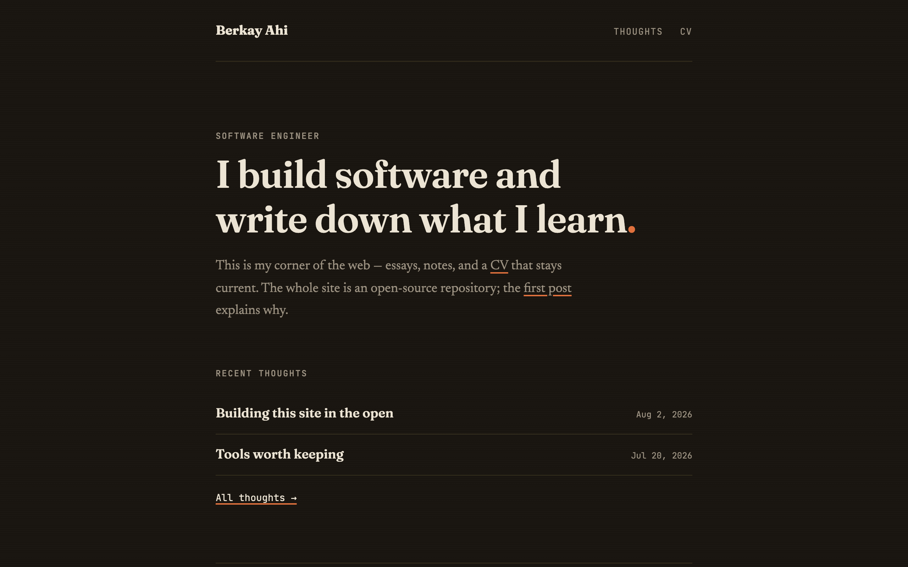

# bahi

Personal website of Berkay Ahi — essays, notes, and a CV. Built in the open: the entire site, content included, lives in this public repository.



## Ideology

A personal site should be **honest software**:

- **No hidden machinery.** Every post is a markdown file you can read right here. The Git history is the archive.
- **No servers.** The site compiles to static HTML and is served from Cloudflare Pages. Nothing to patch, nothing to back up.
- **No secrets in the repo.** The only credential (a GitHub OAuth secret for the admin panel) lives in a Cloudflare Worker's environment, never in this codebase.
- **Boring by design.** Standard tools, minimal dependencies, content outlives the stack.

## Stack

| Layer | Tool |
|---|---|
| Static site generator | [Astro](https://astro.build) |
| Admin panel / CMS | [Sveltia CMS](https://github.com/sveltia/sveltia-cms) (git-based, no database) |
| Hosting | [Cloudflare Pages](https://pages.cloudflare.com) |
| CMS auth | [sveltia-cms-auth](https://github.com/sveltia/sveltia-cms-auth) on a Cloudflare Worker |

Writing happens at `/admin` — a full editor UI that commits markdown to this repo. Cloudflare Pages sees the commit and redeploys. Publish-to-live takes about a minute.

## Screenshots

| Thoughts | Post |
|---|---|
|  |  |

| CV | Dark mode |
|---|---|
|  |  |

## Development

```sh
npm install
npm run dev      # http://localhost:4321
npm run build    # static output in dist/
```

Content lives in `src/content/`:

- `thoughts/*.md` — blog posts (`draft: true` hides a post from the built site, but note: the file is still visible in this public repo)
- `pages/cv.md` — the CV page

## Deploying

1. Push this repo to GitHub.
2. In Cloudflare Pages: **Create project → connect the repo**. Build command `npm run build`, output directory `dist`. Done — every push to `main` deploys.

### Admin panel auth (one-time setup)

Sveltia CMS needs a tiny OAuth bridge so it can commit on your behalf:

1. Deploy [sveltia-cms-auth](https://github.com/sveltia/sveltia-cms-auth) to a Cloudflare Worker (one click from their README).
2. Create a GitHub OAuth App (callback: `https://<your-worker>.workers.dev/callback`) and put its client ID/secret in the **Worker's** environment variables.
3. Set `base_url` and `repo` in [public/admin/config.yml](public/admin/config.yml).

Then open `yoursite.com/admin` and sign in with GitHub.

## License

Code: MIT. Words and images: © Berkay Ahi, all rights reserved.
