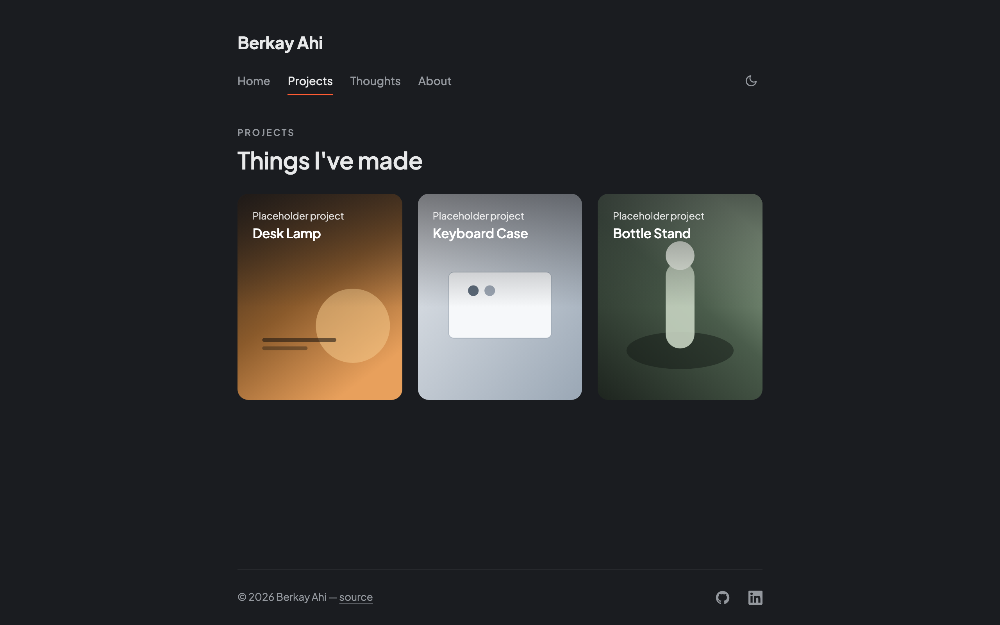
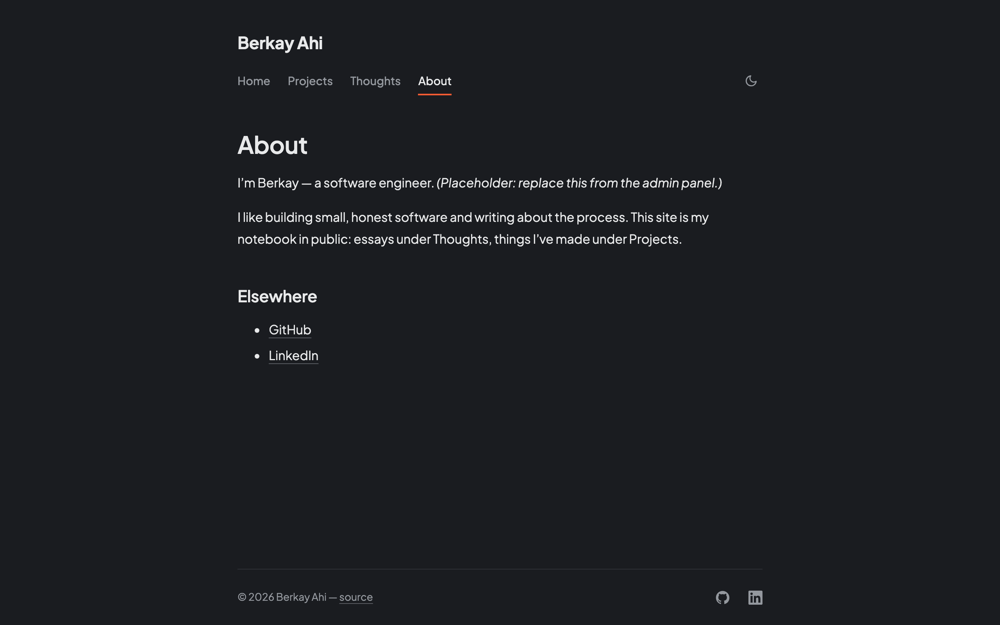
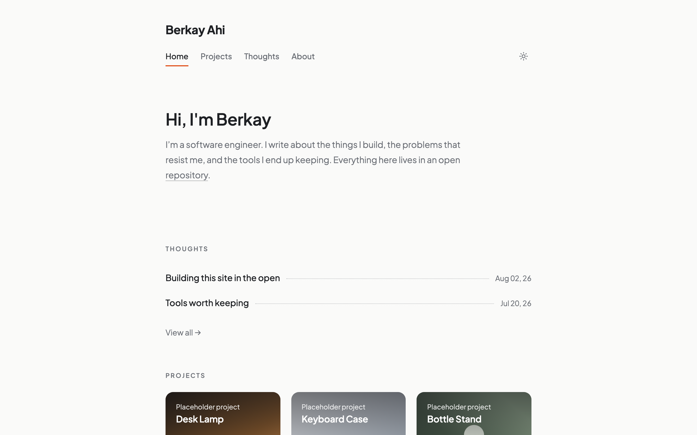

# bahi

Personal website of Berkay Ahi — essays, notes, and projects. Built in the open: the entire site, content included, lives in this public repository.


## How it works

- All content (posts, projects, pages, even site settings) is markdown/YAML in `src/content/`. Astro compiles it to plain HTML at build time. No database, no server code.
- Editing happens at `/admin` (Sveltia CMS). Saving in the admin = a Git commit to this repo = an automatic redeploy. Editing the files directly and pushing works exactly the same.
- The repo contains zero secrets. The one credential that exists (a GitHub OAuth secret for the admin login) is stored as an environment variable on a Cloudflare Worker.

## Stack

| Layer | Tool |
|---|---|
| Static site generator | [Astro](https://astro.build) |
| Admin panel / CMS | [Sveltia CMS](https://github.com/sveltia/sveltia-cms) (git-based, no database) |
| Hosting | [Cloudflare Pages](https://pages.cloudflare.com) |
| CMS auth | [sveltia-cms-auth](https://github.com/sveltia/sveltia-cms-auth) on a Cloudflare Worker |

Writing happens at `/admin` — a full editor UI that commits markdown to this repo. Cloudflare Pages sees the commit and redeploys. Publish-to-live takes about a minute.

## Screenshots

Dark by default, with a light mode toggle.

| Thoughts | Post |
|---|---|
|  |  |

| Projects | About |
|---|---|
|  |  |



## Development

```sh
npm install
npm run dev      # http://localhost:4321
npm run build    # static output in dist/
```

Content lives in `src/content/`:

- `thoughts/*.md` — blog posts (`draft: true` hides a post from the built site, but note: the file is still visible in this public repo)
- `projects/*.md` — projects with cover images (shown as cards on the home page and `/projects`)
- `pages/about.md` — the About page
- `pages/cv.md` — CV content, currently unpublished (no route renders it)

## Deploying (Cloudflare)

**Goal: every `git push` to `main` rebuilds and publishes the site automatically.**

1. Push this repo to GitHub.
2. In the [Cloudflare dashboard](https://dash.cloudflare.com): **Workers & Pages → Create → connect your GitHub repo**.
3. When asked how to build it, enter:
   - Build command: `npm run build`
   - Output / assets directory: `dist`
4. Deploy. Cloudflare gives you a `*.workers.dev` (or `*.pages.dev`) URL. From now on, pushing to `main` — whether from your terminal or from the admin panel — publishes automatically in ~1 minute.

## Enabling the admin panel (one-time)

The admin at `/admin` needs a way to log you in with GitHub and commit on your behalf. That's a tiny separate Worker acting as an OAuth bridge. Set it up once:

1. **Deploy the bridge.** Go to [sveltia-cms-auth](https://github.com/sveltia/sveltia-cms-auth) and click its "Deploy to Cloudflare Workers" button. Note the Worker URL it gets, e.g. `https://sveltia-cms-auth.YOURNAME.workers.dev`. In the Worker's settings, make sure the `workers.dev` route is **enabled** so the URL actually responds.
2. **Create a GitHub OAuth App** at [github.com/settings/developers](https://github.com/settings/developers) → New OAuth App:
   - Homepage URL: your site URL
   - Authorization callback URL: the Worker URL from step 1 + `/callback`

   Copy the Client ID and generate a Client Secret.
3. **Give the Worker the credentials.** In the Worker's **Settings → Variables and Secrets**, add `GITHUB_CLIENT_ID` and `GITHUB_CLIENT_SECRET` (as a secret). Optionally add `ALLOWED_DOMAINS` with your site's domain(s), comma-separated, wildcards allowed — this stops strangers from using your bridge.
4. **Point the site at the bridge.** In [public/admin/config.yml](public/admin/config.yml), set `base_url` to the Worker URL and `repo` to your `username/repo`. Commit and push.

Open `yoursite.com/admin`, sign in with GitHub once, and you can edit everything: posts, projects, the About page, the home intro, and site settings (name, nav, social links).

## License

Code: MIT. Words and images: © Berkay Ahi, all rights reserved.
